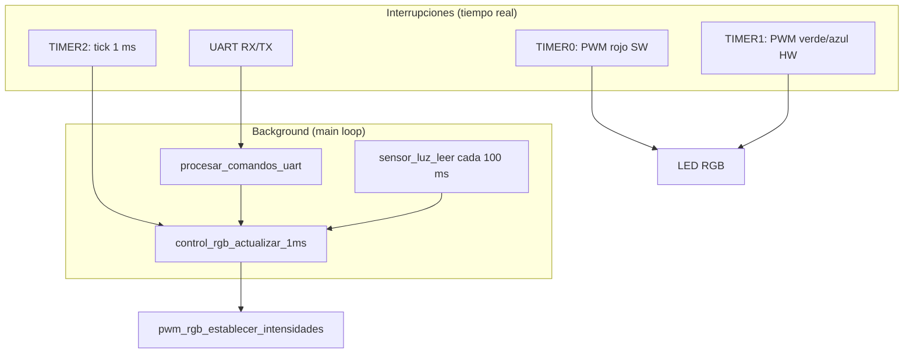

# Análisis del proyecto — TP4 Control LED RGB

Documento de referencia para la exposición presencial y la entrega del TP4 (Circuitos Digitales y Microcontroladores, UNLP 2026).

---

## Qué hace el sistema

Es un firmware **bare metal** para AVR (ATmega, 16 MHz) que controla un **LED RGB de ánodo común** con tres funciones simultáneas:

1. **PWM de 8 bits** en R, G y B para fijar el color.
2. **Desvanecimiento periódico** (subida → máximo → bajada → apagado) con período **T** entre 6 s (poca luz) y 3 s (mucha luz), según el LDR en ADC3.
3. **Comandos por UART** (`SET_COLOR=R,G,B`) para cambiar el color sin cortar el ciclo de fade.

El hardware en Proteus: LED en PB5/PB2/PB1 con 220 Ω, LDR + 100 kΩ a GND en PC3, terminal serie 9600 8N1.

---

## Arquitectura y metodología

### Descomposición modular

El código está partido por **responsabilidad**, no por un único archivo monolítico:

| Módulo | Rol |
|--------|-----|
| `main.c` | Orquestación: init, loop principal, sincronización |
| `pwm_rgb.c` | Generación PWM (hardware + software) |
| `control_rgb.c` | MEF del desvanecimiento y escalado de color |
| `sensor_luz.c` | ADC + mapeo lineal ADC → período |
| `timer.c` | Base de tiempo de 1 ms (TIMER2) |
| `uart.c` | UART0 con buffers e interrupciones |
| `comandos.c` | Parser de líneas y validación |

**Metodología:** diseño **event-driven cooperativo**. Las ISRs solo hacen lo mínimo (PWM, tick de 1 ms, RX/TX UART). La lógica pesada corre en **background** dentro del `while(1)`.

### Flujo del loop principal

```c
while (1) {
    procesar_comandos_uart();

    while (obtener_milisegundo_pendiente()) {
        control_rgb_actualizar_1ms();

        contador_lectura_luz_ms++;

        if (contador_lectura_luz_ms >= INTERVALO_LECTURA_LUZ_MS) {
            contador_lectura_luz_ms = 0;

            lectura_luz = sensor_luz_leer();
            control_rgb_establecer_periodo(sensor_luz_calcular_periodo_ms(lectura_luz));
        }
    }
}
```

- **Comandos UART:** se procesan siempre que hay datos (no bloquean el tiempo).
- **Desvanecimiento:** avanza **1 ms por tick** de TIMER2.
- **LDR:** se lee cada **100 ms** por polling (no hace falta ISR de ADC).

Esto evita `_delay_ms()` y mantiene la temporización del fade estable.

---

## Cumplimiento de la consigna

### 1. PWM > 30 Hz, 8 bits en los tres canales

**Verde y azul (PB2, PB1):** TIMER1 en **modo PWM fase correcta de 8 bits**, **modo invertido** (ánodo común: nivel bajo = encendido).

- Prescaler 64 → f ≈ **490 Hz** (>> 30 Hz).
- OCR1A/B dan 256 niveles (0–255).

**Rojo (PB5):** no tiene salida OC hardware. Se usa **PWM por software** con TIMER0:

- Modo normal, 8 bits, prescaler 256 → f ≈ **244 Hz**.
- ISR de overflow inicia el pulso; ISR de comparación lo corta.
- Casos especiales: intensidad 0 = siempre apagado; 255 = sin flanco de apagado (100 % duty).

**Decisión clave:** fase correcta + invertido permite **0 % y 100 % reales**, algo que fast PWM no garantiza igual de bien con ánodo común.

### 2. Comando serie `SET_COLOR=R,G,B`

- Parser estricto en `comandos.c`: valida prefijo, comas, rango 0–255, tolera espacios.
- Al cambiar color, **no reinicia la MEF**: reaplica el nivel actual de fade sobre el nuevo color base (`control_rgb_establecer_color`).
- Respuestas `[CMD_OK]` / `[CMD_ERROR]` por UART.

### 3. Efecto de desvanecimiento

MEF de **4 estados** en `control_rgb.c`:

```
SUBIDA (1 s) → MÁXIMO (1 s) → BAJADA (1 s) → APAGADO (T − 3 s) → repite
```

- Rampa subida/bajada: interpolación lineal 0→255 y 255→0 en 1000 ms.
- Tiempo activo fijo: **3 s** (`TIEMPO_ACTIVO_MS`).
- Si **T = 3 s** (máxima luz): no hay meseta apagada; al terminar la bajada arranca de inmediato la siguiente subida.
- Si **T > 3 s**: el resto del período es LED apagado.

El color se escala con el **mismo factor** en R, G y B (`escalar_componente` con redondeo +127/255), así se mantiene el **tono** y solo cambia la intensidad global.

### 4. Sensor LDR → período T

- ADC canal 3, referencia AVCC, 10 bits, f_ADC = 125 kHz.
- Mapeo lineal: ADC 0 → **6000 ms**, ADC 1023 → **3000 ms**.
- El nuevo período se guarda en `periodo_siguiente_ms` y **solo aplica al inicio del ciclo siguiente**, para no cortar un fade en curso.

---

## Decisiones de diseño (para defender en la mesa)

El archivo `decisiones.txt` resume el “por qué” de cada elección. Para la exposición, conviene agruparlas así:

### Periféricos y temporización

| Decisión | Justificación |
|----------|---------------|
| TIMER1 → G y B | Salidas OC nativas en PB1/PB2 |
| TIMER0 → R por software | PB5 no tiene OC; 256 posiciones = 8 bits |
| TIMER2 → 1 ms | TIMER0 y TIMER1 ya usados; base independiente para la MEF |
| Frecuencias distintas (490 vs 244 Hz) | Consigna solo pide > 30 Hz; se priorizó implementación clara |
| Modo invertido | LED ánodo común; OCR=255 = máxima intensidad lógica |
| PWM fase correcta | 8 bits con 0 % y 100 % usando modo invertido |

### Lógica de aplicación

| Decisión | Justificación |
|----------|---------------|
| MEF en lugar de delays | Fases distintas, transiciones temporales, sin bloqueos |
| Período al ciclo siguiente | Evita saltos bruscos en T |
| Escalado proporcional RGB | Conserva el color elegido durante el fade |
| ADC cada 100 ms, polling | Luz ambiente lenta; ~104 µs por conversión; baja carga CPU |
| Mapeo lineal LDR→T | Consigna fija solo extremos; interpolación simple y verificable |
| Sin corrección gamma | El TP pide proporciones PWM eléctricas, no percepción visual |
| UART por interrupciones | RX/TX no bloquean el tick de 1 ms del desvanecimiento |

### Robustez UART

- Buffers lineales RX (64) y TX (128).
- Detección de desborde, trama inválida, comando largo.
- Procesamiento de líneas **fuera** de la ISR de recepción (solo encola bytes).

### Detalle de decisiones técnicas (`decisiones.txt`)

- **¿Por qué fase correcta?** Ofrece 8 bits y permite representar 0 % y 100 % usando modo invertido con el LED de ánodo común.
- **¿Por qué modo invertido?** El LED se enciende con nivel bajo; así OCR=255 sigue significando máxima intensidad para el usuario.
- **¿Por qué TIMER0 para rojo?** PB5 no posee salida OC. TIMER0 proporciona desborde y comparación para generar por software los dos flancos.
- **¿Por qué TIMER2?** TIMER0 y TIMER1 ya están ocupados con PWM; TIMER2 genera una base independiente de 1 ms.
- **¿Cómo obtiene 8 bits el PWM rojo?** TIMER0 cuenta 256 posiciones y OCR0A puede ubicar el flanco en cualquiera de ellas, con tratamiento especial para 0 y 255.
- **¿Por qué el apagado dura T−3 s?** Subida, máximo y bajada consumen tres segundos; el resto completa el período total.
- **¿Qué pasa cuando T=3 s?** No queda tiempo para una meseta apagada; comienza inmediatamente la siguiente subida.
- **¿Por qué se multiplican los tres colores por el mismo nivel?** Para variar la intensidad total conservando la proporción y el tono elegidos.

---

## Diagrama conceptual



---

## Periféricos utilizados

| Periférico | Uso | Configuración relevante |
|------------|-----|-------------------------|
| TIMER1 | PWM hardware verde (OC1B/PB2) y azul (OC1A/PB1) | Fase correcta 8 bits, invertido, prescaler 64 |
| TIMER0 | PWM software rojo (PB5) | Modo normal 8 bits, ISRs OVF + COMPA, prescaler 256 |
| TIMER2 | Base de tiempo 1 ms | CTC, OCR2A=249, prescaler 64 |
| ADC | Lectura LDR en PC3/ADC3 | AVCC, 10 bits, prescaler 128 |
| UART0 | Comandos y respuestas | 9600 bps, 8N1, RX/TX por interrupciones |

---

## Qué mostrar en Proteus / debugger

1. **Registros TIMER1** (TCCR1A/B, OCR1A/B): PWM en verde/azul al cambiar `SET_COLOR`.
2. **PORTB bit 5 + TCNT0/OCR0A**: flancos del PWM rojo por software.
3. **TIMER2 / variable de tick**: avance de 1 ms y transiciones de la MEF.
4. **ADCH:ADCL (ADC)**: variación del período T al tapar/destapar el LDR.
5. **Terminal virtual**: comando válido e inválido, respuesta inmediata sin “congelar” el fade.

---

## Puntos fuertes del proyecto

1. **Separación clara** entre tiempo real (ISRs) y lógica de aplicación (MEF + parser).
2. **Cumple restricciones hardware** (PB5 sin OC) con solución documentada y medible.
3. **Comportamiento predecible**: T mínimo 3 s, cambio de color sin reset del ciclo, período LDR diferido al siguiente ciclo.
4. **Código legible y alineado con la consigna**: nombres en español, constantes nombradas, comentarios en decisiones técnicas.

---

## Posibles preguntas del docente (y respuesta corta)

| Pregunta | Respuesta |
|----------|-----------|
| ¿Por qué no usaste el mismo timer para todo? | TIMER0/1 generan PWM; TIMER2 da la base de 1 ms sin interferir. |
| ¿Por qué polling en ADC y no interrupción? | Una conversión cada 100 ms; el bloqueo es ~104 µs y es despreciable frente al intervalo. |
| ¿Qué pasa si mando `SET_COLOR` en medio de la subida? | Se actualizan R/G/B base y se reaplica el nivel actual de la rampa; el estado de la MEF no cambia. |
| ¿Cómo verificás 8 bits? | 256 niveles vía OCR en hardware; en rojo, OCR0A ubica el flanco en cualquiera de las 256 cuentas del ciclo. |
| ¿Por qué frecuencias PWM distintas en cada canal? | La consigna solo exige > 30 Hz; se priorizó una implementación clara con buenos extremos de duty cycle. |

---

## Estructura de archivos del proyecto

```
Entregable4/
├── consigna.pdf
├── decisiones.txt
├── analisis_proyecto.md          ← este documento
└── TP_LED_RGB/
    ├── main.c
    ├── pwm_rgb.c / pwm_rgb.h
    ├── control_rgb.c / control_rgb.h
    ├── sensor_luz.c / sensor_luz.h
    ├── timer.c / timer.h
    ├── uart.c / uart.h
    └── comandos.c / comandos.h
```

---

## Bibliotecas utilizadas

- `<avr/io.h>` — acceso a registros del microcontrolador.
- `<avr/interrupt.h>` — macros `sei()`, `cli()`, declaración de ISRs.
- `<stdint.h>` — tipos enteros de ancho fijo.
- `<stdio.h>` — `snprintf` para formatear respuestas UART.
- `<string.h>` — `strncmp` para validar prefijos de comandos.

No se usan bibliotecas externas ni frameworks: es firmware bare metal compilado con AVR-GCC.
